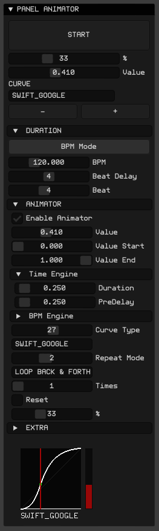

# ofxSurfingTween

## Overview
An **openFrameworks** add-on to tween grouped ```ofParameters``` to Target values using powerful Easing Animators.

**ofxSurfingTween** is just a kind of helper with the **ofxSurfingAnimators** engine ```ofParameters``` bridge, plottings, easy integration workflow, GUI, and settings management.  

(Powered with the awesome **ofxAnimatable**)  

## Screenshots


### Animator Detail


## Features
- Tween Engine with all the **ofxAnimatable** power: 
    * 50+ curves.
	* Play modes: once, loop, back and forth, and play n times.
	* Duration Time (ms) scaled or BPM MODE.
	* Plot preview.
- Simple use: Just pass your ```ofParameterGroup``` parameters container.
- Another usable ```ofParameterGroup``` will be created with the same parameters structure.
- Only ```Float``` and ```Int``` types yet.
- Scalable and draggable plots. SOLO monitor to one parameter with full size.
- Auto Store/Recall all the settings.
- **ImGui** based GUI, docking, ready to integrate.
- Some testing tools like timed randomizers.

## Workflow Usage
  **1.** Set the Source params that will be used as Target values (destination).
  **2.** Set and Tweak the Easing Animator: duration, BPM scaled, pre pause, curve types...etc. 
  **3.** Trig the Easing Animator for all the parameres. 
  **4.** Get the Tweened Target values to use in your scene.

## Usage
 
**ofApp.h**
```.cpp
#include "ofxSurfingTween.h"

ofxSurfingTween dataTween;

ofParameterGroup params; // group container
ofParameter<float> lineWidth;
ofParameter<float> separation;
ofParameter<float> speed;
ofParameter<int> amount;
ofParameter<int> shapeType;
```

**ofApp.cpp**
```.cpp
void ofApp::setup() 
{
    params.setName("paramsGroup");
    params.add(lineWidth.set("lineWidth", 0.5, 0.0, 1.0));
    params.add(separation.set("separation", 50.0, 1.0, 100.0));
    params.add(speed.set("speed", 0.5, 0.0, 1.0));
    params.add(amount.set("amount", 1, 1, 10));
    params.add(shapeType.set("shapeType", 0, 0, 3));

    dataTween.setup(params);
}

void ofApp::update() 
{
    // Get the tweened parameters:
    float _lineWidth = dataTween.get(lineWidth);
    float _separation = dataTween.get(separation);
    float _speed = dataTween.get(speed);
    int _amount = dataTween.get(amount);
    int _shapeType = dataTween.get(shapeType);
}
```

<details>
  <summary>Dependencies</summary>
  <p>

Clone these add-ons and include into the **OF PROJECT GENERATOR** to allow compile your projects or the examples:
* [ofxSurfingAnimators](https://github.com/moebiussurfing/ofxSurfingAnimators) 
* [ofxAnimatable](https://github.com/moebiussurfing/ofxAnimatable)  [ FORK ] 
* [ofxHistoryPlot](https://github.com/moebiussurfing/ofxHistoryPlot)  [ FORK ]
* [ofxScaleDragRect](https://github.com/moebiussurfing/ofxScaleDragRect)  [ FORK ]
* [ofxImGui](https://github.com/Daandelange/ofxImGui/tree/ofParameters-Helpers-Test)  [ FORK/BRANCH ]  
* [ofxSurfingHelpers](https://github.com/moebiussurfing/ofxSurfingHelpers)  
* [ofxWindowApp](https://github.com/moebiussurfing/ofxWindowApp)  [ Only for **example** ]  

_Thanks a lot to all these ofxAddons coders. Specially to @**armadillu**_  
  </p>
</details>

<details>
  <summary>Tested Systems</summary>
  <p>

  - **Windows 10** / **VS 2017** / **OF ~0.11**
  </p>
</details>

### TODO
+ Add more types: 2D/3D vectors and colors. Using templates [?] ...  
  [ _**ANY HELP/PULL ON THIS IS APPRECIATED!**_ ]
+ Add "real" nested sub-groups with indented tree levels. Now the params are recreated on one depth level only. This could help when duplicated names or indent sub-groups on a GUI too.

## Author
An add-on by **@moebiusSurfing**  
*( ManuMolina ) 2021*  

[Twitter](https://twitter.com/moebiussurfing/)  
[YouTube](https://www.youtube.com/channel/UCzUw96_wjmNxyIoFXf84hQg)  
[Instagram](https://www.instagram.com/moebiussurfing/)  
